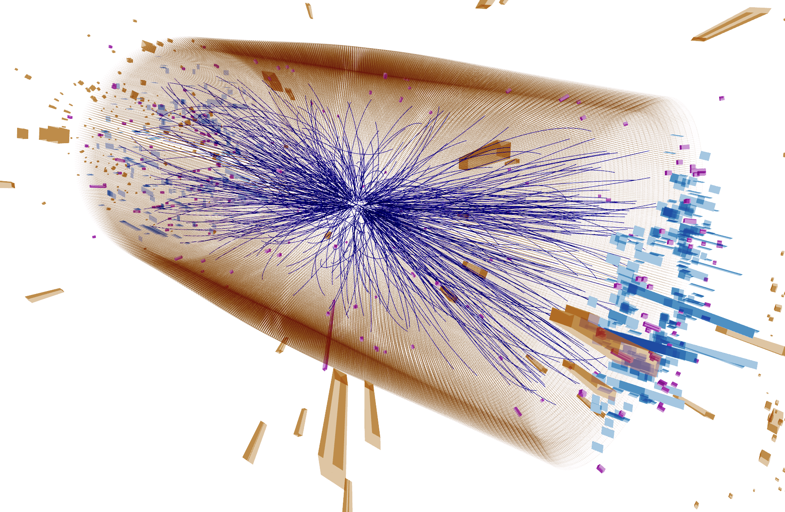

# Particle Images: Electron vs Photon Classification 

Machine Learning algorithms have become an increasingly important tool for analyzing the data from the Large Hadron Collider (LHC). Identification of particles in LHC collisions is an important task of LHC detector reconstruction algorithms.

Here we present a challenge where one of the detectors (the Electromagnetic Calorimeter or ECAL) is used as a camera to analyze detector images from two types of particles: electrons and photons that deposit their energy in this detector. 

## Dataset 
Each pixel in the image corresponds to a detector cell, while the intensity of the pixel corresponds to how much energy is measured in that cell. Timing of the energy deposits are also available, though this may or may not be relevant. The dataset contains 32x32 Images of the energy hits and their timing (channel 1: hit energy and channel 2: its timing) in each calorimeter cell (one cell = one pixel) for the two classes of particles: Electrons and Photons. The dataset contains around four hundred thousand images for electrons and photons. Please note that your final model will be evaluated on an unseen test dataset. 
## Challenge 1 - CNN
Please use a Machine Learning model of your choice to achieve the highest possible classification performance on the provided dataset. 
### Example Notebook of CNN based approach (Using Pytorch):      [
## Challenge 2 (Advanced)- ViT
The field of Computer Vision has for years been dominated by Convolutional Neural Networks (CNNs) which use filters and create feature used by a multi-layer perceptron to perform the desired classification. But recently this field has been incredibly revolutionized by the architecture of Vision Transformers (ViT), which through the mechanism of self-attention has proven to obtain excellent results on many tasks. Please implement Vision Transformer or any of its variation to achieve highest possible classification performance on the dataset. 
### Example Notebook of ViT based approach (Using TensorFlow):     

### Note: 
Both the challenges will be considered as separate challenges. You may participate in either or both. Please provide a Jupyter Notebook that shows your solution.

## Evaluation Metrics  
* ROC curve (Receiver Operating Characteristic curve) and AUC score (Area Under the ROC Curve)   
* Training and Validation Accuracy   

The model performance will be tested on a hidden test dataset based on the above metrics.
## Deliverables  
* Google Colab Jupyter Notebook showing your solution along with the final model accuracy (Training and Validation), ROC curve and AUC score. More details regarding the format of the notebook can be found in the sample Google Colab notebook provided for this challenge.  
* The final trained model including the model architecture and the trained weights ( For example: HDF5 file, .pb file, .pt file, etc. ). You are free to choose Machine Learning Framework of your choice.

## Contributors: 
* Sergei Gleyzer (Department of Physics & Astronomy, University of Alabama)    
* Emanuele Usai (Physics Department, Brown University)  
* Michael Andrews (Physics Department, Carnegie Mellon University)  
* Shravan Chaudhari (Birla Institute of Technology & Science - Pilani, Goa Campus, India)   
* Purva Chaudhari (Vishwakarma Institute of Technology, India)
* Eric Reinhardt (Department of Physics & Astronomy, University of Alabama)
