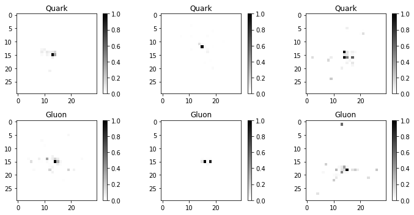

# QML Challenge

The goal of the challenge is to use a quantum machine learning model to perform anomaly detection on a particle physics dataset.
The idea is to train a model on brackground data only. Afterwards, we want to use the model to seperate signal and background events in a test dataset.

## Dataset

For the dataset we provide simulated detector images of quark and gluon jets. In order to reduce the computational burden, we reduced the images to the size `30x30`. The dataset can be obtained [here]().

The images show jets which originate from a Quark or from Gluons. The Quark initiated jets are labeld as $1$, while the Gluon initiated jets are labeled as $0$. We want to train on the Quark initiated jets and then tag the gluon jets.

Some example samples are shown below:

The top row shows the quark initiated jets, while the bottom row shows gluon initiated jets. 

## Model

You are free to choose any model you like. However in the spirit of quantum machine learning we put a limit on the maximum number of parameters you are allowed to use.

## Challenge and Evaluation

We evaluate the challenge on the AUC of a blackbox testset. To be considered for the challenge, a solutions needs to satisfy the following criteria:

1. The model is trained only on Quark jets (label 1)
2. The model has a maximum of xxx parameters
3. The solution is submitted as a executable notebook where which can be run without any additional third party libraries.

## Example notebook

We provide an example notebook which shows how to load the dataset and evaluate the performance of an anomaly detection model:

In the example we train a __classical__ autoencoder. 

